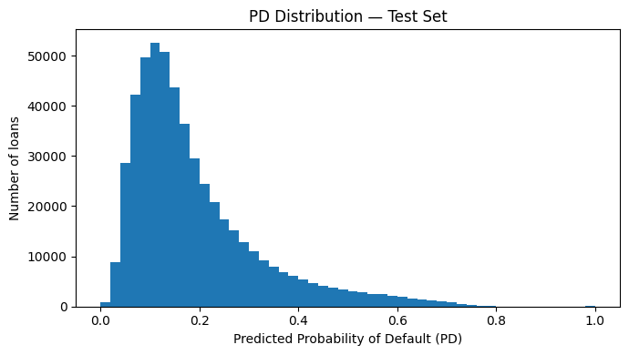
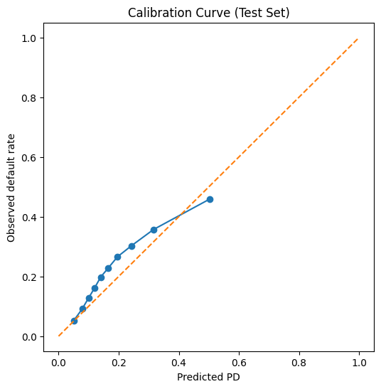
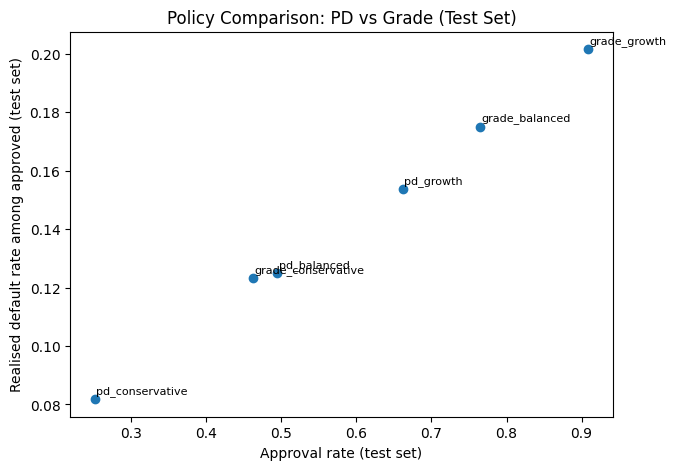

# Credit Risk & PD Decision System

An end-to-end credit analytics project that transforms raw loan-level data into **credit approval decisions** using SQL-based KPIs, probabilistic risk modelling, and portfolio-level policy simulation.

The project mirrors how a real credit risk or analytics team would operate:  
start with governed data and KPIs, build a leakage-safe Probability of Default (PD) model, and translate model outputs into concrete approval policies with measurable portfolio impact.

---

## Project Overview

**Objectives**
- Build a production-style analytics workflow using SQL and Python
- Estimate loan-level Probability of Default (PD)
- Compare PD-based approval policies against traditional grade cut-offs
- Quantify trade-offs between approval rate, default risk, and expected loss

**Tech Stack**
- Python (pandas, scikit-learn, matplotlib)
- SQL (SQLite)
- Jupyter notebooks
- BI-ready outputs (CSV + visuals)

---

## Workflow Summary

### 1) Data inspection
Initial exploration of schema, missingness, date ranges, and string-encoded numeric fields (interest rate, utilisation, employment length).

### 2) SQL staging & cleaning
- Raw CSV chunk-loaded into SQLite
- Clean, typed `clean_loans` table created
- Feature engineering:
  - `term` → `term_months`
  - `emp_length` → numeric years
  - Month strings → ISO dates
  - Average FICO score derived
- Indexes added for KPI performance

### 3) KPI layer
Business-facing credit KPIs built directly in SQL:
- Portfolio exposure, average loan size, rate, and term
- Default rates by grade and sub-grade
- Vintage (issue-year) performance
- Rule-based grade approval policies

**Default definition (realised outcomes only):**
- Default: `Charged Off`, `Default`
- Non-default: `Fully Paid`
- Ongoing loans excluded

---

### 4) PD modelling
A leakage-safe baseline PD model was trained using application-time features only.

**Model**
- Logistic regression
- Median imputation (numeric)
- Most-frequent + one-hot encoding (categorical)
- Time-based train/test split to reflect real deployment

**Performance (test set)**
- ROC-AUC ≈ **0.70**
- Brier score ≈ **0.16**
- Stable calibration across most of the PD range

#### PD distribution (test set)

The distribution shows most loans concentrated in the 5–25% PD range, with a long high-risk tail — supporting the use of continuous PD thresholds rather than coarse grade buckets.

#### PD calibration (test set)

Predicted PDs track observed default rates closely, with mild under-prediction at the highest risk levels, consistent with time-based drift.

---

### 5) PD-based approval & policy simulation
PD predictions were written back to SQLite and used to simulate approval policies on the out-of-sample test set.

Three PD-based policies were evaluated:
- **Conservative:** PD < 10%
- **Balanced:** PD < 15%
- **Growth:** PD < 20%

These were compared directly against traditional grade cut-offs (A–B, A–C, A–D).

#### Policy frontier: PD vs grade

PD-based thresholds form a superior risk–reward frontier, delivering lower default and loss rates at comparable approval levels.

---

## Key Results (Test Set)

- **PD < 10%** approves ~25% of applicants with ~8% realised default rate  
- **PD < 15%** approves ~49% with ~12.5% realised default rate  
- **PD < 20%** approves ~66% with ~15% realised default rate  

In contrast, grade-based policies approve substantially more loans but with materially higher default and expected loss rates.

**Core insight:**  
Grade cut-offs pool heterogeneous risk within discrete buckets. PD-based decisioning enables continuous, transparent control of portfolio risk and cleaner alignment with risk appetite.

---

## Notes on Leakage
Post-origination variables (repayments, recoveries, last payment dates) are explicitly excluded from PD modelling and used only for descriptive KPIs.

---

## Possible Extensions
- PD calibration (Platt / isotonic)
- Expected profit simulation (interest income vs expected loss)
- Segmented LGD / EAD assumptions
- Non-linear models (GBM) for comparison
- Simple scoring function for new applicants

---

## Takeaway
This project demonstrates how raw credit data can be transformed into **actionable approval decisions**, showing not just how to build models, but how to use them responsibly to manage portfolio risk.
